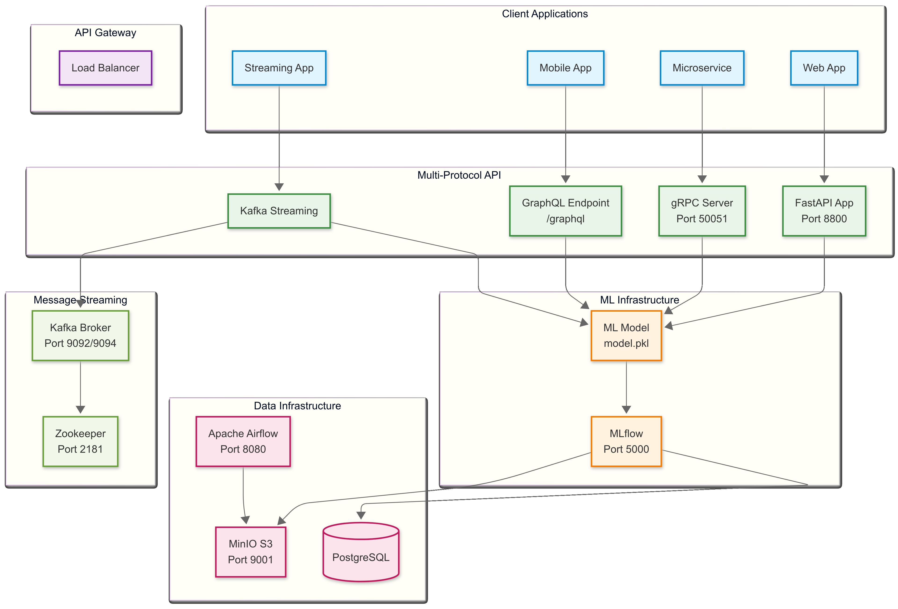

# Maestría en Inteligencia Artificial FIUBA

# Trabajo Práctico Integrador - Operaciones de Aprendizaje Automático II

## API Multiprotocolo de clasificación de estrellas 
**Clasificación de objetos estelares con múltiples protocolos de comunicación**

---

## Integrantes:
- Noelia Qualindi
- Trinidad Monreal 
- Fabian Sarmiento
- Matias Marando
- Jorge Valdez

## Tabla de Contenidos
1. [Dataset y Contexto](#dataset-y-contexto)
2. [Arquitectura del Sistema](#arquitectura-del-sistema)
3. [Nuevas Funcionalidades](#nuevas-funcionalidades)
4. [Estructura del Proyecto](#estructura-del-proyecto)
5. [Instalación y Despliegue](#instalación-y-despliegue)
6. [Uso de la API](#uso-de-la-api)
7. [Comparación de Protocolos](#comparación-de-protocolos)
8. [Testing y Benchmarking](#testing-y-benchmarking)

---

## Dataset y Contexto

**Dataset**: Stellar Classification Dataset - SDSS17 (Sloan Digital Sky Survey)

La API SCO-SDSS17 (Star Classification Objects SDSS) clasifica objetos celestes en tres categorías:
- **Galaxy** (0): Galaxias
- **OSO** (1): Objetos Quasi-estelares (Quasars)  
- **Star** (2): Estrellas

### Componentes del Sistema Original:
- **DAG en Apache Airflow**: `process_et_stellar_data` para preprocesamiento y normalización
- **Experimentación con MLflow**: Optimización de hiperparámetros usando Optuna
- **Modelo Productivo**: Artefacto `model.pkl` servido via API
- **API REST**: Endpoint FastAPI para predicciones

### Nuevas Funcionalidades Implementadas:
✅ **GraphQL API**: Consultas flexibles y tipado fuerte  
✅ **gRPC Service**: Alto rendimiento con Protocol Buffers  
✅ **Kafka Streaming**: Procesamiento en tiempo real  
✅ **Multi-Protocol Support**: Una aplicación, cuatro protocolos  
✅ **Performance Benchmarking**: Comparación automática de rendimiento

---

## Arquitectura del Sistema




---

## Estructura del Proyecto

```
tp-amq2-service-ml/
tp-amq2-service-ml/
├── airflow/ # Apache Airflow DAGs y configuración
│ ├── dags/
│ │ ├── etl_process_grupal.py # DAG principal de ETL
│ │ └── retrain_the_model.py # DAG de reentrenamiento
│ └── secrets/ # Configuración de conexiones y variables
│
├── fastapi/ # Servicio principal multi-protocolo
│ ├── app.py # FastAPI principal con GraphQL
│ ├── graphql_schema.py # Schema GraphQL para clasificación
│ ├── grpc_server.py # Servidor gRPC con streaming
│ ├── kafka_streaming.py # Consumidor/Productor Kafka
│ ├── model_manager.py # Gestión centralizada del modelo ML
│ ├── proto/ # Protocol Buffers definitions
│ │ └── star_classification.proto
│ ├── requirements.txt # Dependencias multi-protocolo
│ ├── Dockerfile # Build con generación gRPC
│ └── files/
│ ├── model.pkl # Modelo ML productivo
│ └── data_star.json # Metadatos del pipeline
│
├── frontend/ # Aplicación React con MUI y Vite
│ ├── public/ # Archivos públicos (favicon, index.html)
│ ├── src/ # Componentes y vistas
│ │ ├── components/ # Componentes como InputForm, HistoryList, etc.
│ │ ├── App.tsx # App principal
│ │ ├── main.tsx # Punto de entrada
│ │ ├── theme.ts # Tema MUI personalizado
│ │ └── index.css # Estilos globales
│ ├── package.json # Dependencias frontend
│ └── vite.config.ts # Configuración Vite
│
├── notebook_example/ # Notebooks experimentación
│ ├── experiment_mlflow.py # Experimentos MLflow + Optuna
│ ├── mlflow_aux.py # Utilidades MLflow
│ └── plots.py # Visualizaciones
│
├── resources/ # Ejemplos de implementación
│ ├── gRPC_GraphQL_REST.py # Tutorial implementaciones
│ └── data_streaming1_kafka.py # Ejemplo Kafka streaming
│
├── docker-compose.yaml # Orquestación multi-servicio
├── test_clients.py # Cliente de testing multi-protocolo
├── API_USAGE_GUIDE.md # Guía detallada de uso
└── README.md                       # Este archivo
```

---

## Instalación y Despliegue
---

## ⚙️ Configuración Inicial

Antes de iniciar el proyecto, debés crear el archivo `.env` dentro de la carpeta `frontend/`, copiando el contenido desde `.env.example`:

```bash
# root
cp .env.example .env

# frontend
cd frontend
cp .env.example .env
```

### 1. Despliegue Completo (Todos los Servicios incluyendo el frontend)
```bash
# Todos los servicios incluido Kafka streaming y el frontend
docker compose --profile all up -d
```

### 2. Despliegue por Perfiles
```bash
# Solo servicios de ML (MLflow + API)
docker compose --profile mlflow up -d

# Con soporte de streaming (incluye Kafka)
docker compose --profile streaming up -d

# Solo pipeline de datos (Airflow)
docker compose --profile airflow up -d
```

### 3. Verificación de Servicios

| Servicio | URL | Descripción |
|----------|-----|-------------|
| **🌐 API Multi-Protocol** | http://localhost:8800/ | FastAPI principal con todos los protocolos |
| **📊 API Documentation** | http://localhost:8800/docs | Documentación Swagger interactiva |
| **🔍 Services Info** | http://localhost:8800/services | Información de todos los protocolos |
| **⚡ GraphQL Playground** | http://localhost:8800/graphql | Interface GraphQL interactiva |
| **🏗️ Apache Airflow** | http://localhost:8080 | Gestión de flujos de trabajo |
| **🔬 MLflow** | http://localhost:5000 | Gestión del ciclo de vida ML |
| **💾 MinIO** | http://localhost:9001 | Almacenamiento de objetos S3 |
| **🚀 Frontend en React**| http://localhost:5174 | Interfaz futurista para clasificación de galaxias servido en Vite |


### 4. Puertos Expuestos
- **8800**: FastAPI (REST + GraphQL)
- **50051**: gRPC Service
- **9092**: Kafka Broker (conexiones externas)
- **9094**: Kafka Broker (conexiones internas)
- **2181**: Zookeeper
- **5000**: MLflow Tracking Server
- **8080**: Airflow Webserver
- **9001**: MinIO Console
- **5174**: Frontend servido en Vite

---
## Levantar el frontend localmente (developer mode)

Para correr la interfaz futurista de clasificación de galaxias en modo desarrollo:

```bash
# 1. Moverse a la carpeta del frontend
cd frontend

# 2. Instalar dependencias
npm install

# 3. Iniciar servidor de desarrollo
npm run dev
```

## Uso de la API

La API ahora soporta **4 protocolos diferentes** para la clasificación de objetos estelares. Puedes elegir el que mejor se adapte a tus necesidades.

### Datos de Ejemplo
```json
{
    "obj_ID": 1237663784734294016.0,
    "alpha": 135.689,
    "delta": 32.494,
    "u": 23.87882,
    "g": 22.27530,
    "r": 20.39398,
    "i": 19.16763,
    "z": 18.79371,
    "run_ID": 3606,
    "cam_col": 4,
    "field_ID": 587,
    "spec_obj_ID": 6.543777825301504e17,
    "redshift": 0.644,
    "plate": 5812,
    "MJD": 56354,
    "fiber_ID": 171
}
```

### 1. 🔗 REST API (HTTP)

**Python:**
```python
import requests

response = requests.post(
    "http://localhost:8800/predict/",
    json={"features": {
        "obj_ID": 1237663784734294016.0,
        "alpha": 135.689,
        # ... resto de campos
    }}
)
print(response.json())
```

**Bash/cURL:**
```bash
curl -X POST "http://localhost:8800/predict/" \
  -H "Content-Type: application/json" \
  -d '{
    "features": {
        "obj_ID": 1237663784734294016.0,
        "alpha": 135.689,
        "delta": 32.494,
        "u": 23.87882,
        "g": 22.27530,
        "r": 20.39398,
        "i": 19.16763,
        "z": 18.79371,
        "run_ID": 3606,
        "cam_col": 4,
        "field_ID": 587,
        "spec_obj_ID": 6.543777825301504e17,
        "redshift": 0.644,
        "plate": 5812,
        "MJD": 56354,
        "fiber_ID": 171
    }
  }'
```

### 2. ⚡ GraphQL API

**Acceso al playground interactivo:** http://localhost:8800/graphql

**Ejemplo de Mutation:**
```graphql
mutation PredictStar {
  predict(features: {
    objID: 1237663784734294016.0,
    alpha: 135.689,
    delta: 32.494,
    u: 23.87882,
    g: 22.27530,
    r: 20.39398,
    i: 19.16763,
    z: 18.79371,
    runID: 3606,
    camCol: 4,
    fieldID: 587,
    specObjID: 6.543777825301504e17,
    redshift: 0.644,
    plate: 5812,
    MJD: 56354,
    fiberID: 171
  }) {
    intOutput
    strOutput
  }
}
```

**Python con requests:**
```python
import requests

query = """
mutation PredictStar($features: StarClassificationInput!) {
    predict(features: $features) {
        intOutput
        strOutput
    }
}
"""

variables = {"features": {
    "objID": 1237663784734294016.0,
    "alpha": 135.689,
    # ... resto de campos
}}

response = requests.post(
    "http://localhost:8800/graphql",
    json={"query": query, "variables": variables}
)
```

### 3. 🚀 gRPC Service

**Generar archivos Python del proto:**
```bash
cd dockerfiles/fastapi
python -m grpc_tools.protoc \
  -I./proto \
  --python_out=. \
  --grpc_python_out=. \
  ./proto/star_classification.proto
```

**Cliente Python:**
```python
import grpc
import star_classification_pb2
import star_classification_pb2_grpc

# Conexión
channel = grpc.insecure_channel('localhost:50051')
stub = star_classification_pb2_grpc.StarClassificationServiceStub(channel)

# Predicción individual
request = star_classification_pb2.StarFeatures(
    obj_ID=1237663784734294016.0,
    alpha=135.689,
    delta=32.494,
    # ... resto de campos
)

response = stub.Predict(request)
print(f"Predicción: {response.int_output} ({response.str_output})")

# Health check
health_response = stub.HealthCheck(
    star_classification_pb2.HealthCheckRequest()
)
print(f"Estado: {health_response.status}")

# Streaming (multiple predictions)
requests = [request] * 5
for response in stub.PredictStream(iter(requests)):
    print(f"Stream: {response.int_output} ({response.str_output})")
```

### 4. 📡 Kafka Streaming

**Enviar datos para predicción:**
```python
from kafka import KafkaProducer
import json

producer = KafkaProducer(
    bootstrap_servers=['localhost:9092'],
    value_serializer=lambda x: json.dumps(x).encode('utf-8')
)

data = {
    "obj_ID": 1237663784734294016.0,
    "alpha": 135.689,
    # ... resto de campos
}

producer.send('star_features_input', value=data)
producer.flush()
```

**Recibir predicciones:**
```python
from kafka import KafkaConsumer
import json

consumer = KafkaConsumer(
    'star_predictions_output',
    bootstrap_servers=['localhost:9092'],
    value_deserializer=lambda x: json.loads(x.decode('utf-8'))
)

for message in consumer:
    prediction = message.value
    print(f"Predicción recibida: {prediction}")
```

**Endpoint de testing:**
```bash
curl -X POST "http://localhost:8800/stream/test" \
  -H "Content-Type: application/json" \
  -d '{
    "obj_ID": 1237663784734294016.0,
    "alpha": 135.689,
    "delta": 32.494,
    "u": 23.87882,
    "g": 22.27530,
    "r": 20.39398,
    "i": 19.16763,
    "z": 18.79371,
    "run_ID": 3606,
    "cam_col": 4,
    "field_ID": 587,
    "spec_obj_ID": 6.543777825301504e17,
    "redshift": 0.644,
    "plate": 5812,
    "MJD": 56354,
    "fiber_ID": 171
  }'
```

---

## Comparación de Protocolos

| Aspecto | REST | GraphQL | gRPC | Kafka Streaming |
|---------|------|---------|------|----------------|
| **🚀 Latencia** | Media | Media | Baja | Alta (async) |
| **📈 Throughput** | Medio | Medio | Alto | Muy Alto |
| **📡 Streaming** | No | Limitado | Sí (bidireccional) | Sí (tiempo real) |
| **🔧 Facilidad de uso** | Alta | Media | Baja | Media |
| **📝 Tipado fuerte** | Sí (Pydantic) | Sí (Schema) | Sí (Protobuf) | No |
| **🌐 Compatibilidad** | Universal | Web/Mobile | Multiplataforma | Sistemas distribuidos |
| **⚙️ Complejidad setup** | Baja | Baja | Media | Alta |
| **📊 Debugging** | Fácil | Fácil | Difícil | Medio |

### Casos de Uso Recomendados:

- **🔗 REST API**: Integraciones simples, APIs públicas, desarrollo web tradicional
- **⚡ GraphQL**: Dashboards complejos, aplicaciones móviles, consultas flexibles
- **🚀 gRPC**: Comunicación entre microservicios, sistemas de alta performance, streaming
- **📡 Kafka**: Procesamiento en tiempo real, sistemas distribuidos, alta escala

---

## Testing y Benchmarking

### Cliente de Pruebas Unificado

El proyecto incluye un cliente completo para probar todos los protocolos:

```bash
python test_clients.py
```

**Funcionalidades del cliente:**
- ✅ Testing individual de cada protocolo
- ✅ Benchmarking automático de performance
- ✅ Comparación lado a lado
- ✅ Medición de latencia y throughput
- ✅ Generación de reportes

### Ejemplo de Salida del Benchmark:
```
============================================================
STAR CLASSIFICATION API PERFORMANCE COMPARISON
============================================================

Testing REST API with 100 requests...
  First response: {'int_output': 2, 'str_output': 'Star'}

Testing GraphQL API with 100 requests...
  First response: {'data': {'predict': {'intOutput': 2, 'strOutput': 'Star'}}}

Testing gRPC service with 100 requests...
  First response: {'int_output': 2, 'str_output': 'Star'}

Testing Kafka streaming with 10 messages...
  First response: {'prediction': {'int_output': 2, 'str_output': 'Star'}}

============================================================
PERFORMANCE SUMMARY
============================================================
Service              Avg Time (ms)   Req/Sec         Success Rate
------------------------------------------------------------
REST                 45.23          22.11           100/100
GraphQL              52.18          19.17           100/100
gRPC                 23.45          42.65           100/100
Kafka Streaming      125.67         7.95            10/10
```

### Métricas Disponibles:
- **Latencia promedio**: Tiempo de respuesta por petición
- **Throughput**: Peticiones/mensajes por segundo
- **Tasa de éxito**: Porcentaje de peticiones exitosas
- **Uso de recursos**: CPU y memoria durante las pruebas

---

## Archivos Clave del Proyecto

### 🚀 Servicio Principal
- **`dockerfiles/fastapi/app.py`**: FastAPI principal con GraphQL integrado
- **`dockerfiles/fastapi/requirements.txt`**: Dependencias multi-protocolo
- **`dockerfiles/fastapi/Dockerfile`**: Build con generación automática gRPC

### 🔗 GraphQL
- **`dockerfiles/fastapi/graphql_schema.py`**: Schema completo con tipos y mutations
- **Endpoint**: `/graphql` con playground interactivo

### ⚡ gRPC
- **`dockerfiles/fastapi/proto/star_classification.proto`**: Definición Protocol Buffers
- **`dockerfiles/fastapi/grpc_server.py`**: Servidor gRPC con streaming support
- **Puerto**: `50051` para conexiones gRPC

### 📡 Kafka Streaming
- **`dockerfiles/fastapi/kafka_streaming.py`**: Producer/Consumer para ML streaming
- **Topics**: `star_features_input`, `star_predictions_output`
- **Configuración**: Auto-conecta con Kafka broker

### 🧪 Testing
- **`test_clients.py`**: Cliente unificado para todos los protocolos
- **`API_USAGE_GUIDE.md`**: Guía detallada de uso y ejemplos

### 🔧 Infraestructura
- **`docker-compose.yaml`**: Orquestación completa con perfiles
- **Perfiles disponibles**: `all`, `mlflow`, `airflow`, `streaming`

---

## Troubleshooting

### Problemas Comunes:

**❌ Error: gRPC port already in use**
```bash
# Verificar qué proceso usa el puerto
lsof -i :50051
# Matar proceso si es necesario
kill -9 <PID>
```

**❌ Error: Kafka broker not available**
```bash
# Verificar servicios Kafka
docker compose ps
# Reiniciar servicios Kafka
docker compose restart kafka zookeeper
```

**❌ Error: GraphQL schema not found**
```bash
# Reconstruir contenedor FastAPI
docker compose build fastapi
docker compose up -d fastapi
```

**❌ Error: gRPC proto files missing**
```bash
# Generar archivos proto manualmente
cd dockerfiles/fastapi
python -m grpc_tools.protoc -I./proto --python_out=. --grpc_python_out=. ./proto/star_classification.proto
```

### Verificación de Servicios:
```bash
# Estado de contenedores
docker compose ps

# Logs de un servicio específico
docker compose logs fastapi

# Restart de servicios
docker compose restart fastapi kafka

# Cleanup completo
docker compose down --volumes --rmi all
```

---

## Consideraciones de Producción

### 🔒 Seguridad
- [ ] Implementar autenticación JWT
- [ ] Agregar autorización por roles
- [ ] SSL/TLS para todas las conexiones
- [ ] Rate limiting por protocolo

### 📊 Monitoreo
- [ ] Métricas con Prometheus
- [ ] Dashboards en Grafana
- [ ] Alerting automático
- [ ] Logging distribuido

### 🚀 Escalabilidad
- [ ] Load balancer para FastAPI
- [ ] Múltiples replicas gRPC
- [ ] Particionado Kafka
- [ ] Auto-scaling por demanda

### 🔄 DevOps
- [ ] CI/CD pipelines
- [ ] Tests automatizados
- [ ] Deployment blue-green
- [ ] Rollback automático

---

## Próximos Pasos

1. **🔐 Autenticación**: Implementar JWT across todos los protocolos
2. **📊 Monitoring**: Agregar Prometheus + Grafana stack
3. **🧪 Testing**: Implementar tests unitarios e integración
4. **📚 SDKs**: Crear clients SDKs para múltiples lenguajes
5. **⚡ Optimización**: Optimizar performance y resource usage
6. **🌐 Documentation**: API documentation multilenguaje

---

## Contribuidores y Licencia

**Integrantes del Proyecto:**
- Noelia Qualindi
- Trinidad Monreal 
- Fabian Sarmiento
- Matias Marando
- Jorge Valdez

**Institución:** FIUBA - Maestría en Inteligencia Artificial

**Curso:** Trabajo Práctico Integrador - Operaciones de Aprendizaje Automático II

**Fecha:** 2025

---

*Para preguntas o soporte técnico, consultar el `API_USAGE_GUIDE.md` o crear un issue en el repositorio.*